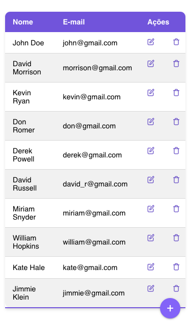

# Apply

## What's it?
This is a CRUD project with React, Typescript, Redux, Hooks and Webpack.

## Sample

## Requirements:
1. `node 14.x or >`

## Running the project:

1. `clone the project`
2. `cd react-redux`
3. `yarn`
4. `yarn dev`
5. `open http://localhost:3003/`